<div align="center">

# Hi 👋, I'm Adarsh Pawar

## 🚀 Creative Technologist & Internet Enthusiast


[](https://www.linkedin.com/in/adarshpawar28)
[](https://twitter.com/adarshpawar28)
[](https://www.instagram.com/adarshpawar_)
[](https://adarshpawar.com)

</div>

---

### 💫 About Me

```javascript
const adarsh = {
  location: 'India 🇮🇳',
  experience: '5+ years',
  focus: ['Web Development', 'Accessibility', 'Open Source'],
  currentWork: 'Building digital experiences & innovative solutions',
  funFact: 'I love creating accessible, scalable applications',
};
```

---

### �️ Tech Stack

<div align="center">

**Languages & Frameworks**


**Backend & Database**


**Tools & Technologies**


</div>

---

### 🏆 Featured Projects

<table>
<tr>
<td width="50%">

#### 📦 [url-object-converter](https://www.npmjs.com/package/url-object-converter)

[](https://www.npmjs.com/package/url-object-converter)
[](https://www.npmjs.com/package/url-object-converter)

JavaScript library for serializing complex objects into URL-friendly query strings. Perfect for state sharing and bookmarkable URLs.

**Tech:** `JavaScript` `NPM Package` `URL Handling`

</td>
<td width="50%">

#### 🎨 [Design System](https://design-system-v8.vercel.app/)

[](https://design-system-v8.vercel.app/)

Interactive platform for crafting UI components with export/import configurations. Promotes consistency and scalable design workflows.

**Tech:** `React` `Component Library` `Design Tokens`

</td>
</tr>
<tr>
<td width="50%">

#### 🔗 Digital Link Vault


Personal link management tool for storing, organizing, and sharing favorite links with curated collections.

**Tech:** `Web App` `Link Management` `Collections`

</td>
<td width="50%">

#### 🌟 Open Source Contributions

[](https://github.com/adarshpawar29)

Active contributor to accessibility tools, educational tech, and supply chain management solutions.

**Focus:** `WCAG Compliance` `EDI Solutions` `Accessibility`

</td>
</tr>
</table>

---

### 📊 GitHub Analytics

<div align="center">
  
  <a href="https://github.com/adarshpawar29">
    
  </a>
  <a href="https://github.com/adarshpawar29">
    
  </a>
  
</div>

<div align="center">
  
  <a href="https://github.com/adarshpawar29">
    
  </a>
  
</div>

<div align="center">
  
  <a href="https://github.com/adarshpawar29">
    
  </a>
  
</div>

<div align="center">
  
  <a href="https://github.com/adarshpawar29">
    
  </a>
  
</div>

<div align="center">
  
  <a href="https://github.com/adarshpawar29">
    
  </a>
  
</div>

---

### 🎯 Specializations

<div align="center">

<table>
<tr>
<td width="25%" align="center">


**🔍 Web Accessibility**

- WCAG 2.1/2.2 Compliance
- ARIA Implementation
- Screen Reader Testing
- Keyboard Navigation
- Color Contrast Auditing

</td>
<td width="25%" align="center">


**⚡ Full Stack Development**

- Modern Frontend Frameworks
- RESTful API Design
- Database Architecture
- Performance Optimization
- Code Quality & Testing

</td>
<td width="25%" align="center">


**🚀 Agile Practices**

- Scrum Master Experience
- DevOps Integration
- CI/CD Pipelines
- Code Review Processes
- Team Leadership

</td>
<td width="25%" align="center">


**🏢 Industry Focus**

- Educational Technology
- Supply Chain Management
- E-commerce Solutions
- Healthcare Systems
- Fintech Applications

</td>
</tr>
</table>

</div>

<div align="center">

### 💡 Core Expertise Visualization

```mermaid
graph LR
    %% Compact radial layout for mobile
    A((🎯 AP))
    
    %% Core skills with shorter names
    A --> B[♿ A11y]
    A --> C[💻 Dev]
    A --> D[📋 Agile]
    A --> E[🏢 Domain]
    
    %% Key skills - compact
    B --> B1[WCAG]
    B --> B2[ARIA]
    C --> C1[React]
    C --> C2[Node]
    D --> D1[Scrum]
    D --> D2[DevOps]
    E --> E1[EdTech]
    E --> E2[Supply]

    %% Compact styling
    style A fill:#ff6b6b,stroke:#333,stroke-width:3px,color:#fff
    style B fill:#4ecdc4,stroke:#333,stroke-width:1px,color:#fff
    style C fill:#45b7d1,stroke:#333,stroke-width:1px,color:#fff
    style D fill:#f9ca24,stroke:#333,stroke-width:1px,color:#000
    style E fill:#6c5ce7,stroke:#333,stroke-width:1px,color:#fff
    
    %% Ultra-thin branches for clean look
    linkStyle default stroke-width:0.5px
    linkStyle 0 stroke:#4ecdc4,stroke-width:0.5px
    linkStyle 1 stroke:#45b7d1,stroke-width:0.5px
    linkStyle 2 stroke:#f9ca24,stroke-width:0.5px
    linkStyle 3 stroke:#6c5ce7,stroke-width:0.5px
    linkStyle 4 stroke:#4ecdc4,stroke-width:0.5px
    linkStyle 5 stroke:#4ecdc4,stroke-width:0.5px
    linkStyle 6 stroke:#45b7d1,stroke-width:0.5px
    linkStyle 7 stroke:#45b7d1,stroke-width:0.5px
    linkStyle 8 stroke:#f9ca24,stroke-width:0.5px
    linkStyle 9 stroke:#f9ca24,stroke-width:0.5px
    linkStyle 10 stroke:#6c5ce7,stroke-width:0.5px
    linkStyle 11 stroke:#6c5ce7,stroke-width:0.5px
```



</div>

---

<div align="center">

### 💬 Let's Connect and Build Something Amazing Together!

[](mailto:contact@adarshpawar.com)
[](https://www.linkedin.com/in/adarshpawar28)
[](https://twitter.com/adarshpawar28)
[](https://adarshpawar.com)


</div>
